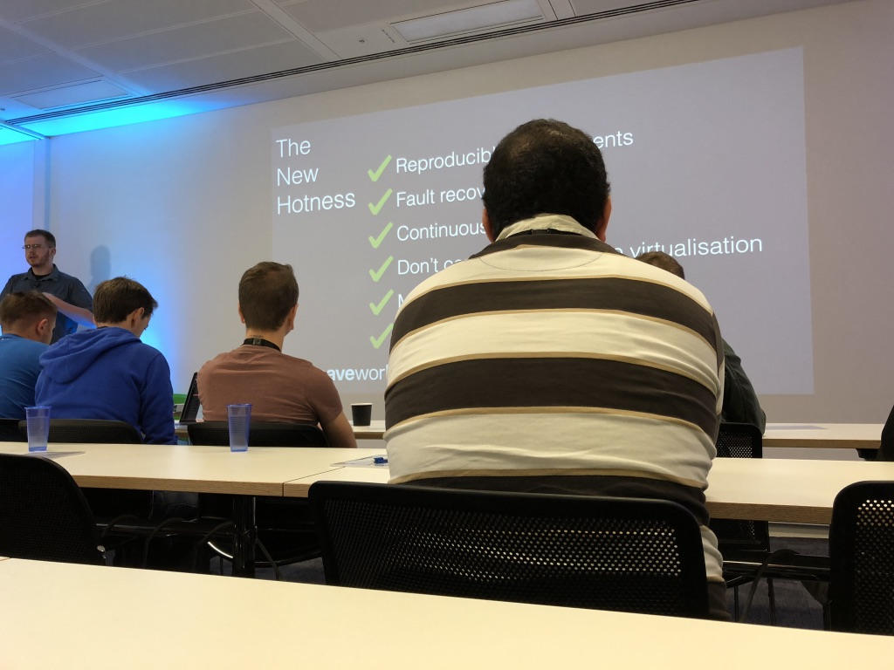
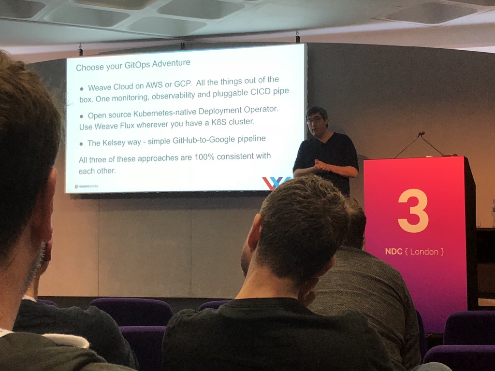

# LEARN / SHARE / REPEAT

^
Welcome.
Thank you for having me here today.

---

# Mental Health

^
Some of my favourite speakers highlight issues within the industry.
I suffer from depression, but I manage it day by day.
I find talking to others fixes things for me.
If you're feeling overwhelmed or ever need to have a chat, drop me a messasge.

---

# TAKE PHOTOS!

^
Feel free to take any photos.
I usually do this at conferences to remind me of a talk.
With 6 tracks and 3 days, its going to be a long, but great conference!

---

# Lewis Denham-Parry

## @denhamparry

^
This is me
Find me on Twitter and feel free to contact me directly.

---

^
🚂🚃🚃
This is our community that I'll be talking about today.

---

## @cloudnativewal

^
🚂🚃
This is our community that I'll be talking about today.

---

# Act 1: Learn

---

# NDC Oslo 2017

^
This was my first conference.
Why Olso?

---

# Change

^
I needed change.
Fell out of love with day to day work.
I wanted to know if there was another option.

---

^
🚂🚃🚃🚃
So I went all in.
I went to this workshop with someone I knew from Pluralsight...

---

^
🚂🚃🚃
Saw the Jon Skeet in person...

---

^
🚂🚃
Made a new friend in Dylan Beattie.
He gave the keynote, which blew me away and made me remember why I love being a developer.

---

^
This is how I felt.
I also took my family with me because I want to share the experiences I get with them.

---

# Back to Earth

^
After spending the weekend we flew back home to Cardiff.
I knew there was more to my 9-5 life.
I wanted to find more people like I met in Oslo.

---

# Meetups

^
I started to attend local meetups.
Looked around Cardiff, then went to Bristol.
Going to London for after work and back the same night.
I also booked some conferences.

---

^
Dylan Beattie recommended ProgNet.

---

^
Met a chap called Ben Hall who introduced me to Katacoda.
At the end of ProgNet, I booked tickets for ProgNet 2018, which gave me a free ticket too...

---

# CloudNativeLondon

^
This was the first Cloud Native London one day conference.

---

^
Sam Newman was there helping me understand what Cloud Native is anyway.

---

^
There was a talk by Brice Fernandes from WeaveWorks.
Said how they deleted all their infrastructure in 1 click and brought it back up in 45 minutes.
I liked the idea of this Cloud Native.

---

# Luck

^
There was a prize draw and I won a ticket to attend a 3 day Kubernetes workshop.

---

^
Met Daniele Polencic.
I started to learn about K8S.

---

# Happiness

^
This made me happy.
I was listening to people talk about how they solved problems.
I made new friends who I could talk tech too.
It made me want to solve problems again.
Found out that I have a medical condition that causes depression.

---

# Speaking

^
2017 was coming to a close.
How do I take it up to the next level?
I wanted to help others like they helped me.

---

# NDC London 2018

^
So I booked NDC London.
My plan was not to just learn tech, but learn how to speak at meetups.

---

^
Went to a workshop with Ben Hall on Kubernetes.
I attended his workshop for 2 days.

---

# Cloud Native Wales

^
We went for a couple of pints after the workshop.
I mentioned about wanting to get into speaking, to which he said...
" There's no Cloud Native Wales"

---

# Act 1: Recap

^
Speak to people.
Enjoy it.
Learn.

---

# Act 2: Share

^
We've now setup CloudNativeWales, but where do we start?

---

^
Alex Ellis and Scott Hanselman gave a talk about Kubernetes on Raspberry Pis
I loved the simplicity of it showing  how it runs using lights on the pis.

---

^
Later that day, I got a message from a local recruiter.
I met him at a workshop in Cardiff asking if I'd run a K8S workshop.
I got this during a talk by Todd from TrackJS about getting into speaking.
I replied "I'm in".

---

^
I also saw a talk by Alexis Richardson about GitOps at NDC London.
I was all in on Cloud Native, and now I needed to prep to give our first workshop.

---

^
The next month, we built the Pi Cluster and practised our workshop.
Ben offered us help by letting us use Katacoda at the workshop.
This was great as it was one less thing for us to worry about.

---

^
We arranged to give a practice talk in our office a week before the workshop.
This helped us get over our initial nerves of speaking.

---

^
So this was our first workshop.
It went really well and we asked people for their feedback.

---

^
It went better than we could have ever expected.
We now knew that people were interested in Cloud Native technologies.
We just had to arrange a meetup...

---

# 3 things you need to run a Meetup

1) Venue
2) Speaker(s)
3) Attendee(s)

---
