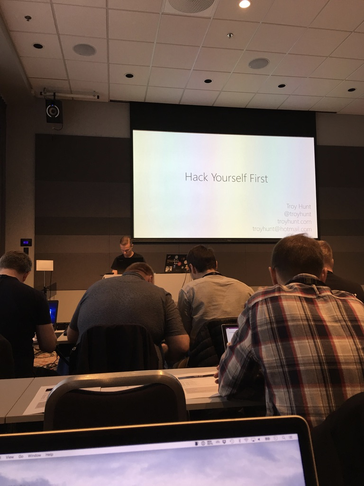

# LEARN / SHARE / REPEAT

^
Welcome.
Thank you for having me here today.

---

# Mental Health

^
Some of my favourite speakers highlight issues within the industry.
I suffer from depression.
I find talking to others fixes things for me.
Conferences can be overwhelming, if you ever need someone to talk to give me a shout.

---

# Lewis Denham-Parry

## @denhamparry

^
This is me
Find me on Twitter and feel free to contact me directly.

---

^
🚂🚃🚃
This is our community that I'll be talking about today.

---

## @cloudnativewal

^
🚂🚃
This is our community that I'll be talking about today.

---

# Act 1: Learn

---

# Tips

^
These are the things I remind myself at each meetup / conference.

---

# Take photos!

^
Feel free to take any photos.
I usually do this at conferences to remind me of a talk.
With 6 tracks and 3 days, its going to be a long, but great conference!
Look back and remember

---

# It's ok not to know what people are talking about

^
I have to remind myself about this every time I listen to a talk.
Here to learn.
It'll take time, but it does click.
Usually when you're all relaxed and about to go to sleep.

---

# Stickers

^
If you learn something, get the sticker.
This was my laptop

---

^
Its so much easier to see the things you don't know.
This helped remind me of want I had learned.
This was my laptop but it filled up.
Stickers will pop up throughout this talk.

---

# Talk / Listen

^
There are so many people here.
I love hearing peoples stories and finding common interests.
Treat others as you'd like to be treated.
Kelsey Hightower tip: be minty fresh.

---

# Case Study: Me

^
I'm a fan of demos and hearing actual stories.

---

# NDC Oslo 2017

^
This was my first conference.
Why Olso?

---

# Change

^
I needed change.
Fell out of love with day to day work.
I wanted to know if there was another option.

---

^
🚂🚃🚃🚃
So I went all in.
I went to this workshop with someone I knew from Pluralsight...

---

^
🚂🚃🚃
Saw the Jon Skeet in person...

---

^
🚂🚃
Made a new friend in Dylan Beattie.
He gave the keynote, which blew me away and made me remember why I love being a developer.

---

^
🚂🚃🚃
This is how I felt.
I also took my family with me because I want to share the experiences I get with them.
After spending the weekend we flew back home to Cardiff.

---

^
🚂🚃
I knew there was more to my 9-5 life.
I wanted to find more people like I met in Oslo.
Laurie loved stickers by the way.

---

# Meetups

^
I started to attend local meetups.
Looked around Cardiff, then went to Bristol.
Going to London for after work and back the same night.
I also booked some conferences.

---

^
Dylan Beattie recommended ProgNet.

---

^
Met a chap called Ben Hall who introduced me to Katacoda.
At the end of ProgNet, I booked tickets for ProgNet 2018, which gave me a free ticket too...

---

# CloudNativeLondon

^
This was the first Cloud Native London one day conference.

---

^
Sam Newman was there helping me understand what Cloud Native is anyway.

---

# Luck

^
There was a prize draw and I won a ticket to attend a 3 day Kubernetes workshop.

---

^
Met Daniele.
I started to learn about K8S.

---

# Happiness

^
This made me happy.
I was listening to people talk about how they solved problems.
I made new friends who I could talk tech too.
It made me want to solve problems again.
Found out that I have a medical condition that causes depression.
Thyroid - hidden dependency.

---

# Speaking

^
2017 was coming to a close.
How do I take it up to the next level?
I wanted to help others like they helped me.

---

# NDC London 2018

^
So I booked NDC London.
My plan was not to just learn tech, but learn how to speak at meetups.

---

^
Went to a workshop with Ben Hall on Kubernetes.
I attended his workshop for 2 days.

---

# Cloud Native Wales

^
We went for a couple of pints after the workshop.
I mentioned about wanting to get into speaking, to which he said...
" There's no Cloud Native Wales"

---

# Act 1: Learn Recap

^
You're learning, if you knew it already it'd be boring anyway.
Photos.
Talk and listen to people, not just the speakers.
Enjoy it.

---

# Act 2: Share

---

# Tips

^
Some quick tips

---

# Commit to a talk

^
If you want to get into talking...
You don't need to know it now.
Plan a talk in 3 months time.
Learn a little, make notes

---

# Drop the ladder

^
Share what you wish you knew from Day 1.
Its easier to focus on the harder, edge case scenarios.
Keep it simple.

---

# Take opportunities

^
Just go for it.
Who here wants to get into speaking?
Who in here wants to be on a stage at NDC?
I have a talk tomorrow and I need some people to help me out.
Come talk to me, message me.

---

# Its not just about speaking!

^
There are so many ways to share.
Run meetups / help meetups / attend meetups.
Write blogs
Contribute to open source.
Don't have to be able to do them all.
Do what you're good at.
I was good at house parties growing up.

---

# Case Study: CNW

^
We've now setup CloudNativeWales, but where do we start?

---

^
Alex Ellis and Scott Hanselman gave a talk about Kubernetes on Raspberry Pis
I loved the simplicity of it showing  how it runs using lights on the pis.

---

^
Later that day, I got a message from a local recruiter.
I met him at a workshop in Cardiff asking if I'd run a K8S workshop.
I got this during a talk by Todd from TrackJS about getting into speaking.
I replied "I'm in".

---

^
The next month, we built the Pi Cluster and practised our workshop.
Ben offered us help by letting us use Katacoda at the workshop.
This was great as it was one less thing for us to worry about.

---

^
We arranged to give a practice talk in our office a week before the workshop.
This helped us get over our initial nerves of speaking.

---

^
So this was our first workshop.
It thought it went well and we asked people for their feedback.

---

^
It went better than we could have ever expected.
We now knew that people were interested in Cloud Native technologies.

---

# 3 things you need to run a Meetup

---

# 1. Venue

^
We were looking to book a place and got quotes fot £150 for 30 people.
This was a risk but then luck and helped out...

---

^
We went to a talk by one of the founders of the DevOpsGroup.
They have an office in one of the tallest buildings in Cardiff.
We mentioned Cloud Native Wales, and he offered their help.
He introduced me to their Head of Recruitment.
I knew him from when we were 16 pushing trolleys in a supermarket car park.

---

^
We found our venue and it was free.

---

# 2. Speakers

^
Just ask people.
You might find out they have family or another reason to be in your city.
Look at other simular meetups for speakers.
Reach out - Email, Twitter, Slack

---

# 3. Attendees

^
Word of mouth.
Meetup.com / Twitter.
Go to other meetups.

---
# Act 2: Share Recap

^
You don't have to code to contribute.
Offer help.
Keep things simple.
Take opportunities.

---

# Act 3: Repeat

---

# Build a community

^
Its not about one person.
Think of it like our infrastructure.
Look at your dependencies.

---

# Build an inclusive community

^
Code of conduct.
Drinks - not just alcohol!
Food - vegetarians / vegans / gluten free.

---

# Create a safe space

^
Its important that we're diverse.
Again, treat others as you'd like to be treated.
Don't be scared to ask questions or help.
Create a feedback loop where people are comfortable.

---

# Promote local speakers

^
Offer lightning talks
Introduce them to other speakers for tips.

---

# Swag

^
Share swag.
People love stickers / tshirts.

---

# Book Clubs

^
Pick a book.
Create a space for people to discuss.
Contact the author.
Setup a video call.

---

# Tech Amnesty 

^
Create local initiatives.
We donate gaming consoles to l

---